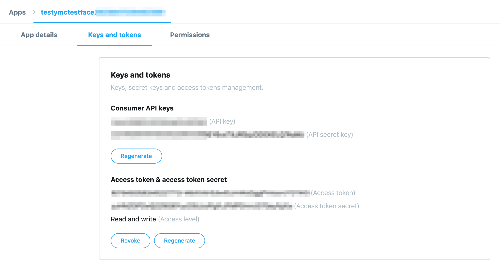

# Kvitter
Kvitter is a twitter fetcher / searcher written in Kotlin. I wrote this in anger because it is
so darned impossible to find a tweet that you know you read some time ago and because the search
features twitter provides are just abysmal. Kvitter will fetch your tweets once per day and provides
a (very basic) search command for searching through all the tweets.

## Getting Started

### Getting API keys from twitter
Before you begin, you need to create API keys for accessing your account via twitter's
APIs. Go to https://dev.twitter.com/apps/new and follow the prompts (this is pretty painful, just 
bear with it). When all that is done, create a "new app" (because obviously we need to register an "app"
in order to use their APIs), call it anything and humor them with your best minimum 100 character
description of your fantastic app. When all that is done, go to the app and click `Keys and tokens`.

Under this tab, you'll see the following:



Here, the first two keys are `oauthConsumerKey` and `oauthConsumerSecret`, respectively,
and the second two keys are `oauthAccessToken` and `oauthAccessTokenSecret`, also respectively.

# Installing Kvitter
  
1. Download the latest release from https://github.com/viktornordling/kvitter/releases
2. Unzip / untar the release somewhere:
   ```
   unzip kvitter-1.0.0.zip
   ```
3. Run the install command. This sets up a Launch Agent (Mac only, pull requests for 
   Windows / Linux  welcome) which will fetch new tweets once per day. Obviously, your computer
   needs to be on at time you choose, so pick some time when your computer is typically on.
   If your computer is not on, don't worry, Kvitter will catch up on the next run (subject
   to twitter's awful [API limitations](https://stackoverflow.com/q/8471489/214429)).
   ```
   cd kvitter
   bin/kvitter install
   ```
4. Follow the instructions:
   ```
    $ bin/kvitter install
    Enter working directory (/Users/vnordling/kvitter): (hit enter)
    Working dir is: /Users/vnordling/kvitter
    Enter hour when fetcher should run (10): (hit enter)
    Enter minute when fetcher should run (0): (hit enter)
    Unloading existing job. Running launchctl command: launchctl unload -w com.github.viktornordling.kvitter.plist
    Running launchctl command: launchctl load -w com.github.viktornordling.kvitter.plist
    Launch agent installed.
    Setting up twitter credentials config file.
    Enter oauthConsumerKey: <enter your oauthConsumerKey>
    Enter oauthConsumerSecret: <enter your oauthConsumerSecret> 
    Enter oauthAccessToken: <enter your oauthAccessToken>
    Enter oauthAccessTokenSecret: <enter your oauthAccessTokenSecret>
   ```

Now, the fetcher will run every day at the given time (10:00 by default). Tweets
will be stored as JSON in an `archive` directory.

To search for tweets, run `bin/kvitter search <keyword>`.

That's it!
